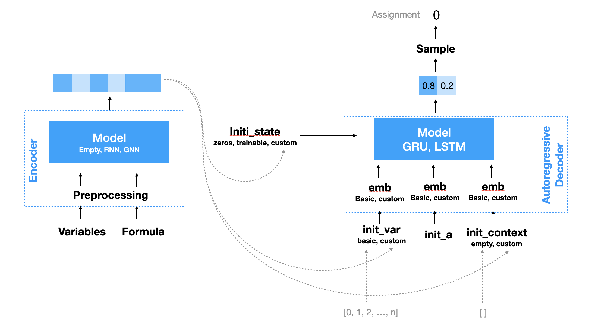

# Learning to solve SAT instances

## Model

## Requirements

You need [PyMiniSolvers](https://github.com/liffiton/PyMiniSolvers).

## Benchmark instances

You can download benchmark instances from [SATLIB](https://www.cs.ubc.ca/~hoos/SATLIB/benchm.html). 
