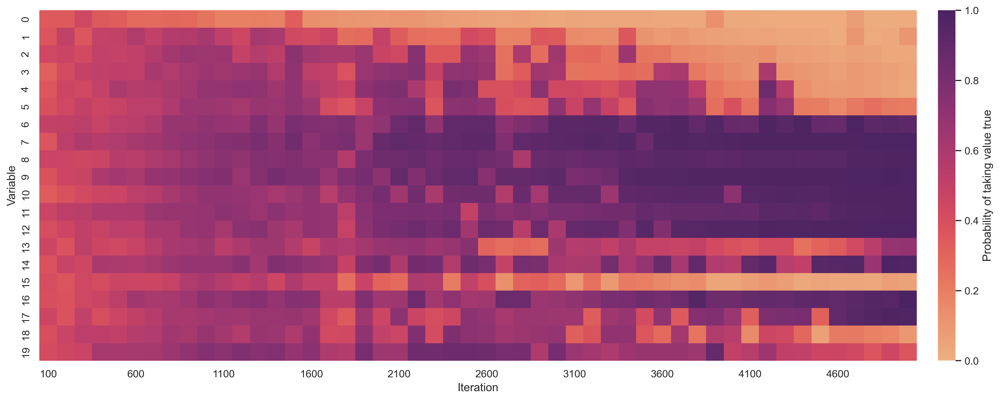
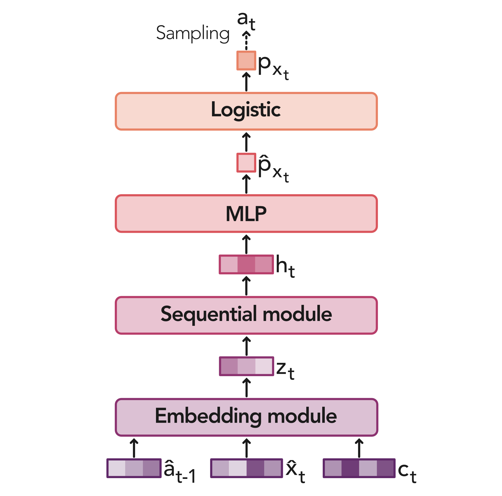

# Policy Gradient MaxSAT Solver

## Model

## Reproducibility

## Requirements

- [PyTorch](https://pytorch.org/get-started/locally/).
- [Pytorch Geometric](https://pytorch-geometric.readthedocs.io/en/latest/notes/installation.html).
- [TensorFlow](https://www.tensorflow.org/install).
- [PyMiniSolvers](https://github.com/liffiton/PyMiniSolvers).
- pip install -U tbparse
- pip install seaborn
- pip install -U "ray[tune]"
- pip install optuna
- pip install networkx

## Benchmark instances

You can download benchmark instances from [SATLIB](https://www.cs.ubc.ca/~hoos/SATLIB/benchm.html).

## Team
